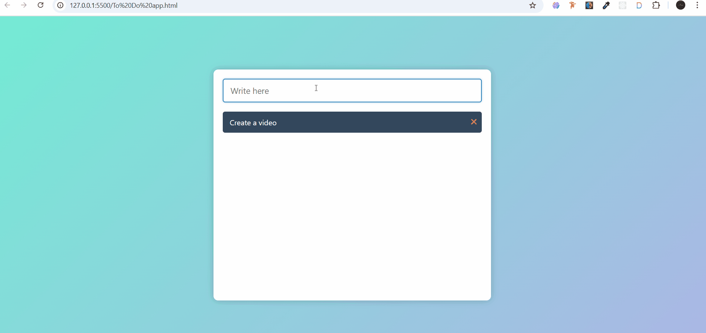

# 📝 To-Do App

A simple and beautiful **To-Do List App** built with **HTML, CSS, and JavaScript**.  
Add tasks, mark them as done, and delete them with just a click.

---

## 📌 Features

- ➕ Add new tasks by pressing **Enter**
- ✅ Mark tasks as completed (line-through style)
- ❌ Delete tasks instantly
- 🎨 Clean and modern UI with hover effects
- 📱 Responsive design

---

## 🛠️ Technologies Used

- **HTML5**
- **CSS3**
- **JavaScript (Vanilla JS)**
- **Font Awesome Icons**

---

## 🎥 Demo

---

## 🧑‍💻 Developer

Developed by Asim Mir  
[GitHub: asim249](https://github.com/asim249)

